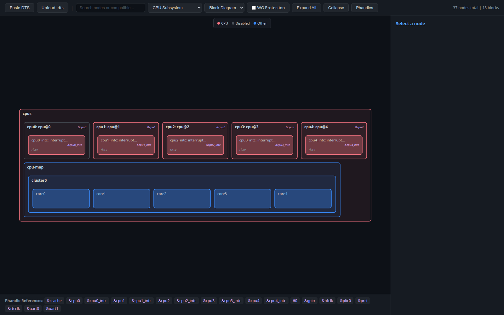
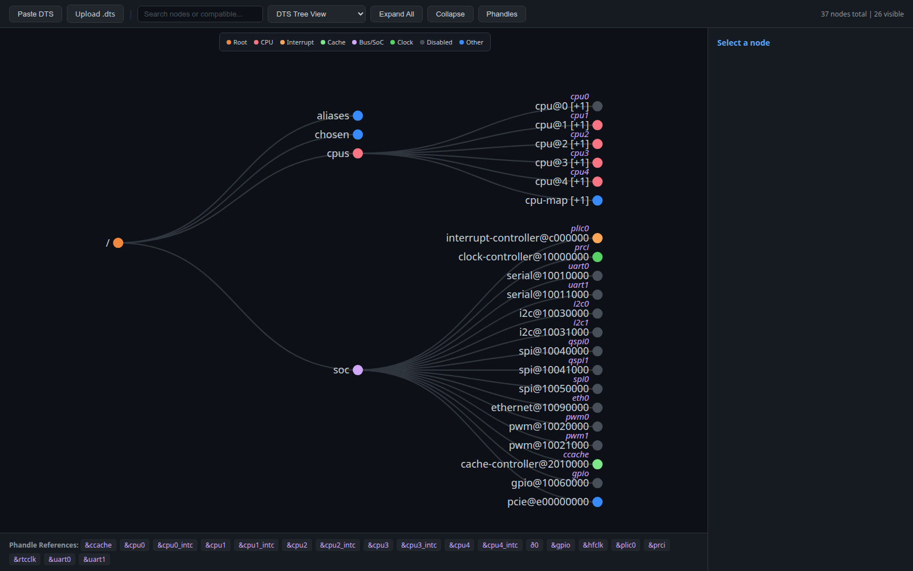
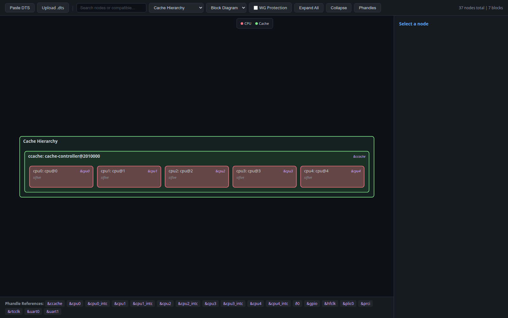
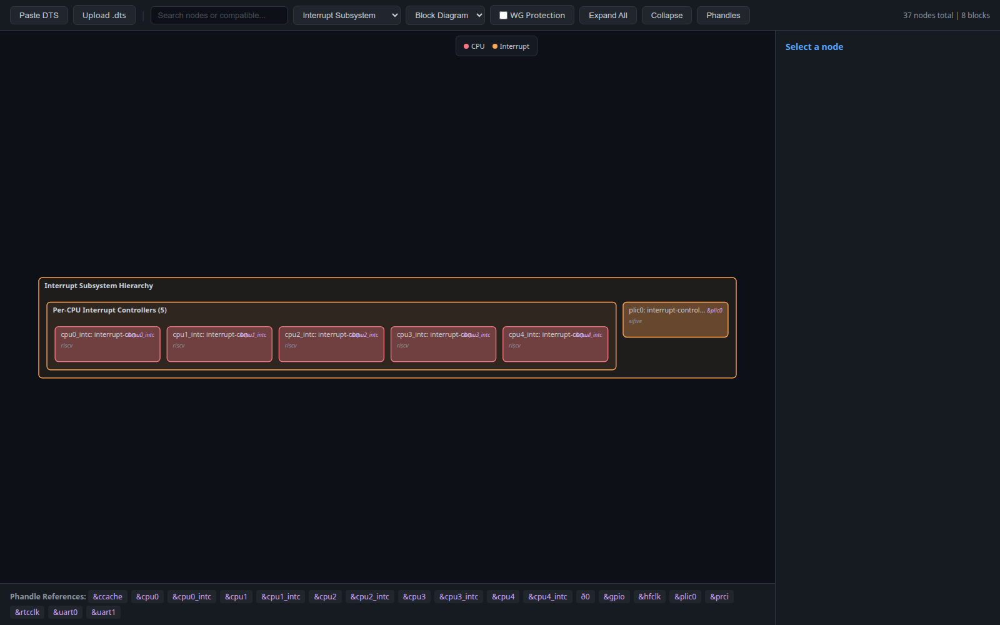
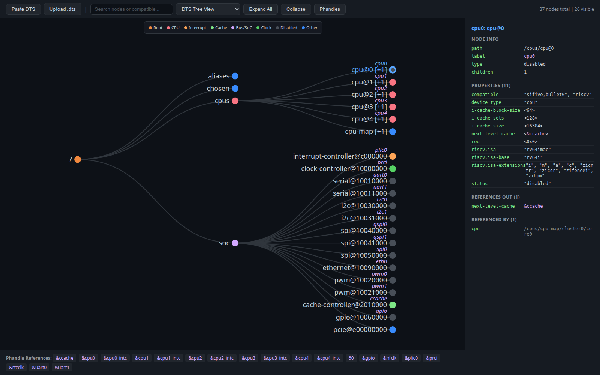

# DTS Visualizer

Interactive viewer for Device Tree Source (`.dts` / `.dtsi`). Drop in raw DTS, get an explorable hierarchy with semantic views for CPU, cache, power, interrupt, trace, RAS, and WorldGuard subsystems — plus a hardware-style block diagram layout.

**Live:** https://woodrow-shen.github.io/dts-visualizer/



---

## Why

Modern SoC device trees have hundreds of nodes wired together by phandle references that cross clusters, power controllers, interrupt managers, cache slices, RAS error mappers, trace funnels, and security guards. Reading the DTS top-to-bottom doesn't tell you the *system structure* — you have to chase `&labels` across thousands of lines in your editor.

This tool builds that structure for you, in the browser, with no setup.

## Features

**Parsing**
- Drop-in for any `.dts` / `.dtsi` — pasted DTS never leaves your browser
- Handles `#include` / `/include/` / `/delete-node/` / `/delete-property/`, line + block comments, labels, addresses, phandle refs in cells, byte strings, string lists, boolean properties

**Two layouts** — toggle in any component view
- **Tree** — classical hierarchy, dense and pannable
- **Block Diagram** — nested rectangles that look like a hardware architecture diagram; great for showing containment and relationships at a glance

**Nine views** — re-organize the DTS by *semantic* relationships rather than file order

| View | What it builds | Phandle property used |
|------|----------------|------------------------|
| DTS Tree | Raw DTS hierarchy | (parent/child) |
| CPU Subsystem | The `/cpus` subtree with cores, intc, cpu-map | (parent/child) |
| Cache Hierarchy | CPUs nested inside the caches they feed | `next-level-cache` |
| Power Management | PMC → SubsystemMC → ClusterMC → TileMC → domains → CPUs | `sifive,power-controller`, `power-domains` |
| Interrupt Subsystem | APLIC → IMSIC, per-CPU INTC, PLIC | `riscv,children`, `msi-parent` |
| RAS (Error Handling) | Error mapping/summary/bank chain | `ras-parents` |
| Trace & Debug | Encoder → funnel → funnel chain | `remote-endpoint`, `sifive,cpu` |
| WorldGuard (Security) | Checkers and their protected subordinates; markers and their origins | `sifive,subordinates`, `sifive,ancestors` |
| Peripherals | UART / SPI / DMA / Ethernet / TRNG / authentication grouped | (compatible-based grouping) |

**Navigation**
- Click any node → properties panel with the full property list
- Phandle references in property values are clickable — jump to the target
- Search box matches node name, label, compatible, reg-name, status, path; auto-expands collapsed branches that contain matches
- Press `/` to focus search, `Esc` to clear
- Phandle arrows toggle — dashed connections between source nodes and their `&` targets
- WorldGuard overlay — on any component view, toggle to annotate each protected node with the WG checker that guards it
- Pan / zoom / expand-all / collapse
- Color-coded node types (CPU, memory, interrupt, cache, bus, clock, power, trace, error/RAS, worldguard, debug, disabled, root) with on-screen legend

**Privacy & deployment**
- Single HTML file, only external dep is D3.js from CDN
- All parsing happens in the browser — your DTS never leaves your machine; safe for proprietary kernel work
- Self-host: drop the file on any static host (GitHub Pages, Netlify, S3, internal nginx)
- Air-gapped: vendor `d3.v7.min.js` next to the HTML and update the `<script src>`

## Quick start

1. Visit **https://woodrow-shen.github.io/dts-visualizer/**
2. Paste your DTS, or upload a `.dts` / `.dtsi`
3. Click **Parse & Visualize**
4. Try different views from the **DTS Tree View** dropdown; switch the **Layout** dropdown to **Block Diagram** for hardware-diagram-style nesting

## Gallery

Tree view of a real RISC-V SoC (`fu740-c000.dtsi`):



Block diagram of the same SoC's CPU subsystem (cpus → cpu0..4 → per-core intc, plus cpu-map → cluster0 → cores):


Cache hierarchy block diagram (CPUs are visually inside the L3 they consume, derived from `next-level-cache`):



Interrupt subsystem block diagram (Per-CPU INTCs grouped, PLIC as sibling):



Click on a node and you get the full property panel with clickable phandle refs:



## Local development

```bash
git clone git@github.com:woodrow-shen/dts-visualizer.git
cd dts-visualizer
# Open the HTML directly in any browser:
xdg-open dts-visualizer.html   # or just double-click

# Run E2E tests (requires google-chrome installed)
npm install
npm test
```

## Tests

Playwright E2E suite (`tests/e2e.test.mjs`, 11 tests, ~10 s) drives a real headless Chrome against the HTML, feeding it `arch/riscv/boot/dts/sifive/fu740-c000.dtsi` from the linux kernel and asserting parse → render → click → search → view-switch → block layout → phandle navigation all behave correctly.

```
npm test
```

Set `LINUX_ROOT` to point at a different kernel checkout if your fixture path differs.

## Stack

Vanilla JS + D3.js v7 in a single ~78 KB HTML file. No framework, no build step, no backend.
